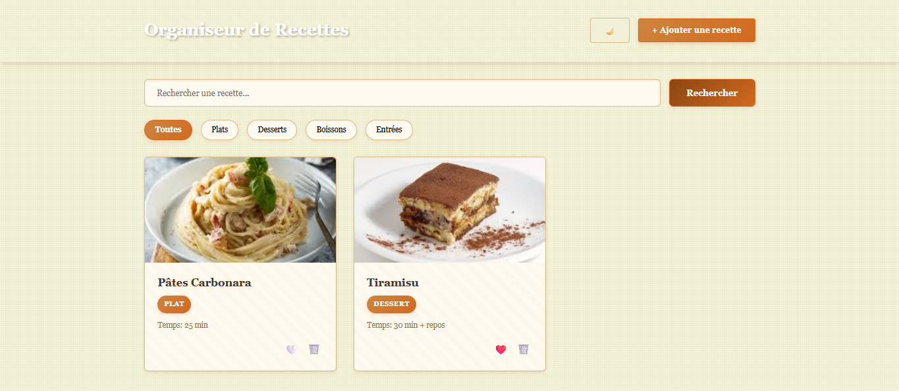

# Recipe_Organizer 

## Description
Application web permettant d’ajouter, organiser et consulter des recettes de cuisine avec catégories, ingrédients et étapes détaillées.  
Ce projet est le **vingt-sixième** du défi personnel **100 projets en 2026**.

---

## Objectifs du projet
- Implémenter un CRUD complet
- Structurer des données complexes (ingrédients + étapes)
- Mettre en place un système de recherche
- Gérer des filtres par catégorie
- Organiser un affichage en cartes moderne

---

## Plateforme
- Web (navigateur)

---

## Technologies utilisées
- HTML
- CSS
- JavaScript (Vanilla)
- LocalStorage

---

## Fonctionnalités
- Ajout d’une recette :
  - Titre
  - Catégorie (dessert, plat, boisson…)
  - Liste d’ingrédients
  - Étapes de préparation
- Affichage des recettes en cartes
- Recherche par nom
- Filtre par catégorie
- Suppression d’une recette
- Sauvegarde locale des données

---

## Design & UX
- Cartes visuelles organisées
- Barre de recherche en haut
- Filtres visibles et accessibles
- Interface chaleureuse et épurée
- Responsive (mobile et desktop)

---

## Captures d’écran

---

## Ce que j’ai appris
- Gestion d’un CRUD structuré
- Manipulation de tableaux d’objets complexes
- Implémentation de filtres dynamiques
- Organisation d’une interface en cartes
- Amélioration de l’expérience utilisateur

---

## Améliorations possibles
- Ajout d’image pour chaque recette
- Temps de préparation
- Système de favoris
- Édition d’une recette
- Mode sombre

---

## Statut du projet
 **Projet terminé**